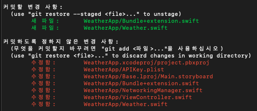

# Networking

### Open Weather site

[https://openweathermap.org](https://openweathermap.org)


## API 키 숨기는 방법

1. Plist 파일 생성

<figure><figcaption></figcaption></figure>

2. git ignore 설정&#x20;

<figure><figcaption></figcaption></figure>

3. key 딕셔너리 생성

<figure><figcaption></figcaption></figure>

4. Bundle extension 작성

```swift
import Foundation

extension Bundle {
    var apiKey: String {
        guard let file = self.path(forResource: "APIKey", ofType: "plist") else { return "" }
        
        guard let resource = NSDictionary(contentsOfFile: file) else { return "" }
        
        guard let key = resource["APIKey"] as? String else {
            fatalError("API KEY ERROR")
        }
        return key
    }
}

```

## 네트워킹 코드 작성

### Model 정의하기

[API 문서](https://openweathermap.org/forecast5)를 확인하여 필요한 데이터를 기반으로 모델을 작성한다.

내가 필요한 데이터는 오늘 (현재 온도, 날씨 아이콘) / 주간 (날짜, 최고 최저 온도, 날씨 아이콘)

```swift
struct NetworkData: Codable {
    let cod: String
    let message, cnt: Int
    let list: [List]
    let city: City
}

// MARK: - City
struct City: Codable {
    let id: Int
    let name: String
    let coord: Coord
    let country: String
}

// MARK: - Coord
struct Coord: Codable {
    let lat, lon: Int
}

// MARK: - List
struct List: Codable {
    let dt: Int
    let temperature: Temperature
    let weather: [Weather]
    let dtText: String
    
    enum CodingKeys: String, CodingKey {
        case dt
        case temperature = "main"
        case weather
        case dtText = "dt_txt"
    }
}

// MARK: - MainClass
struct Temperature: Codable {
    let temp, tempMin, tempMax: Double
    let tempKf: Double

    enum CodingKeys: String, CodingKey {
        case temp
        case tempMin = "temp_min"
        case tempMax = "temp_max"
        case tempKf = "temp_kf"
    }
    
    var celsius: Double {
        temp - 273.15
    }
    
    var maxCelsius: Double {
        tempMax  - 273.15
    }
    
    var minCelsius: Double {
        tempMin - 273.15
    }
    
    var furmula: Double {
        temp * 9 / 5 - 459.67
    }
    
    var minFurmula: Double {
        tempMin * 9 / 5 - 459.67
    }
    
    var maxFurmula: Double {
        tempMax * 9 / 5 - 459.67
    }
}

// MARK: - Weather
struct Weather: Codable {
    let id: Int
    let parameter: Parameter
    let description: String
    let icon: String
    
    enum CodingKeys: String, CodingKey {
        case id
        case parameter = "main"
        case description
        case icon
        
    }
}

enum Description: String, Codable {
    case brokenClouds = "broken clouds"
    case clearSky = "clear sky"
    case fewClouds = "few clouds"
    case lightRain = "light rain"
    case overcastClouds = "overcast clouds"
    case scatteredClouds = "scattered clouds"
}

enum Parameter: String, Codable {
    case clear = "Clear"
    case clouds = "Clouds"
    case rain = "Rain"
}

```

### Network Error 정의

```swift
enum NetworkError: Error {
    case networkError
    case dataError
    case parseError
}
```


### NetworkManager 작성

* 해당 클래스는 상속이 일어나지 않으므로, final로 작성한다.
* 클래스 외부에서 fetch request만 작성할 수 있도록 함수를 분리하여 pirvate으로 관리한다.
* Singleton으로 설계하여 객체가 여러개 생성되는 것을 방지한다.

```swift
final class NetworkManager {
    
    static let shared = NetworkManager()
    
    typealias NetworkCompletion = (Result<[List], NetworkError>) -> Void
    
    func fetchData(completion: @escaping NetworkCompletion) {
        performRequest(with: "https://api.openweathermap.org/data/2.5/forecast?lat=37&lon=126&lang=kr&appid=\(Bundle.main.apiKey)") { result in
            completion(result)
        }
    }
    
    private func performRequest(with urlString: String, completion: @escaping NetworkCompletion) {
        
        guard let url = URL(string: urlString) else { return }
        
        let session = URLSession(configuration: .default)
        
        let task = session.dataTask(with: url) { (data, response, error) in
            
            if error != nil {
                completion(.failure(.networkError))
                return
            }
            
            guard let safeData = data else {
                completion(.failure(.dataError))
                return
            }
            
            if let datas = self.parseJSON(safeData) {
                completion(.success(datas))
            } else {
                completion(.failure(.parseError))
            }
        }
        
        task.resume()
    }
    
    private func parseJSON(_ data: Data) -> [List]? {
        do {
            let data = try JSONDecoder().decode(NetworkData.self, from: data)
            return data.list
        } catch {
            return nil
        }
    }
}
```


## Trouble Shooting

### URL Error

```
finished with error [-1002] Error Domain=NSURLErrorDomain Code=-1002 "unsupported URL"

NSErrorFailingURLStringKey
```

* 이건 내가 앞에 https://를 붙여주지 않아서 나타난 에러였다.
* 안전한 도메인인지 확인할 수 없을 때, iOS에서 자체적으로 네트워킹을 제한해서 발생한 문제이다.
  * 만약 해당 도메인을 사용해야한다면, 해당 도메인을 신뢰한다는 설정을 해줘야한다.
  * 검색 키워드: 예외 도메인 ATS(App Transport Security)에 대해 공부해보자.


### APIKey GIt ignore 적용 안 됨

* git status를 통해 확인해봤는데, 분명 git ignore에 있는 파일이 존재함

<figure><figcaption><p>WeatherApp/APIKey.plist는 포함되면 안 된다</p></figcaption></figure>

```
git update-index --skip-worktree WeatherApp/APIKey.plist 
```

<figure><figcaption></figcaption></figure>

* 다시 포함시키고 싶을 때

```
git update-index --no-skip-worktree WeatherApp/APIKey.plist
```

[출처: 나른한 코딩](https://nareunhagae.tistory.com/44)


